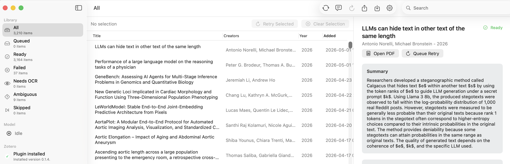
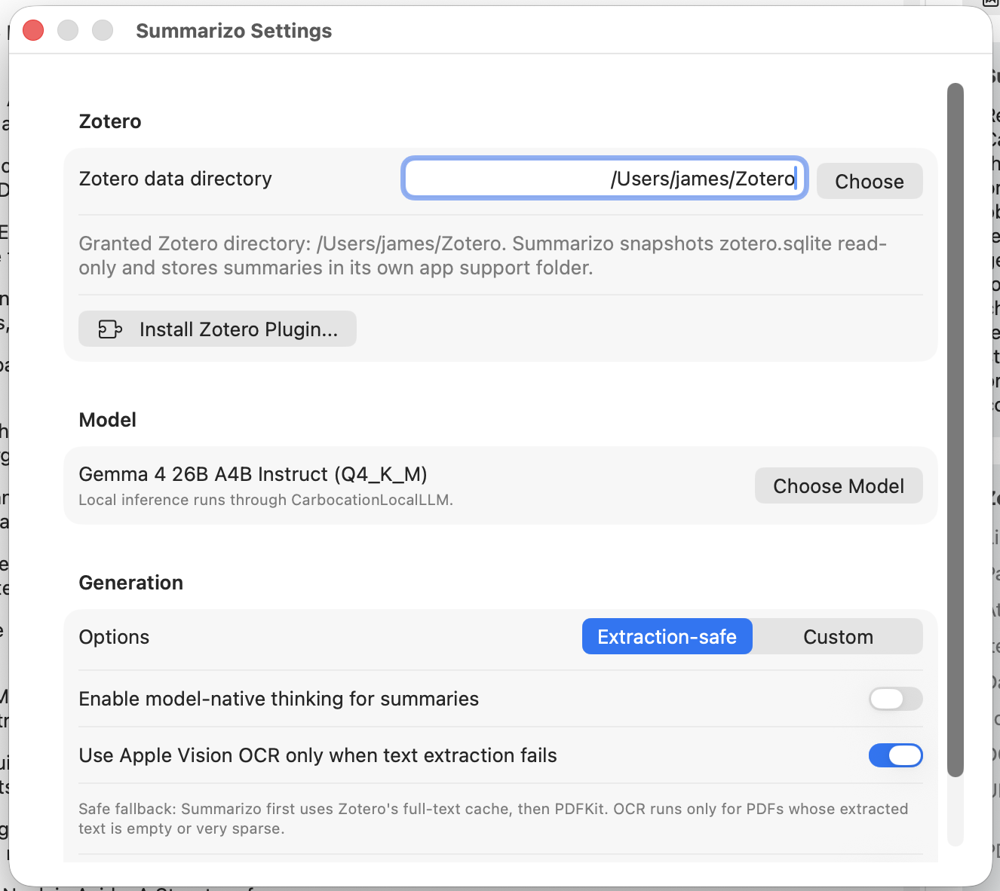
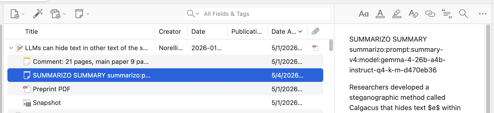

# Summarizo

Summarizo is a macOS app for Zotero users who want concise AI summaries of the PDFs already attached to their Zotero library.

It scans your local Zotero data directory, finds the primary PDF attached to each item, extracts text, generates summaries with a local model, and lets you export those summaries for review or import them back into Zotero as tagged child notes.

## Download

Download the newest version from the Summarizo GitHub Releases page:

[Download the latest Summarizo release](https://github.com/carbocation/Summarizo/releases/latest)

On the release page, download the latest `Summarizo` `.dmg` file, open it, and move `Summarizo.app` into your Applications folder.

Summarizo requires macOS 14 or later.

## What Summarizo Does

Summarizo helps you move from a Zotero library full of PDFs to a library with searchable, tagged summary notes.

- Reads your Zotero data directory after you grant macOS file access.
- Takes a read-only snapshot of Zotero's database instead of modifying Zotero directly.
- Finds primary child PDF attachments and skips records that only appear to have supplemental material.
- Uses Zotero's full-text cache first, then PDF text extraction, with optional Apple Vision OCR when text extraction fails.
- Runs summary generation through local inference.
- Stores summaries in Summarizo's own app data.
- Exports summaries as both `.tsv` and `.jsonl` files.
- Bundles a Zotero plugin that imports the `.jsonl` export into Zotero as child notes.

## Screenshots

### Main Summarizo library window after scanning Zotero.

### Summarizo Settings showing the Zotero data directory and plugin install button.

### Zotero item with an imported Summarizo child note.

## First Run

1. Open Summarizo.
2. Open Settings.
3. In the Zotero section, choose your Zotero data directory. This is usually the folder that contains `zotero.sqlite` and `storage`.
4. Choose a summary model in the Model section.
5. Return to the main window and click Scan Zotero.
6. Review the queued papers.
7. Click Summarize.

When summaries are ready, select an item to read its summary, source PDF path, and diagnostics. You can open the source PDF from the detail pane.

## Export Summaries

Click Export in Summarizo's toolbar. Summarizo creates two files:

- `summarizo-YYYYMMDD-HHMMSS.tsv` for spreadsheets and manual review.
- `summarizo-YYYYMMDD-HHMMSS.jsonl` for Zotero import.

Finder opens to the export files after export finishes. Use the `.jsonl` file when importing summaries into Zotero.

## Load Summarizo Summaries Into Zotero

Summarizo includes a Zotero plugin named `Summarizo Zotero Importer.xpi`. Install it once, then use it whenever you want to load a new Summarizo export.

### Install the Zotero Plugin

1. Open Summarizo.
2. Open Settings.
3. Click Install Zotero Plugin.
4. Summarizo opens Finder and selects `Summarizo Zotero Importer.xpi`.
5. Open Zotero.
6. In Zotero, choose Tools > Plugins.
7. Drag `Summarizo Zotero Importer.xpi` from Finder into Zotero's Plugins window, or use Zotero's install-from-file control if it is visible.
8. Restart Zotero if prompted.
9. Confirm Zotero now shows Tools > Import Summarizo Summaries.

### Import an Export

1. In Summarizo, click Export after your summaries are ready.
2. In Zotero, choose Tools > Import Summarizo Summaries.
3. Select the `summarizo-YYYYMMDD-HHMMSS.jsonl` file from Summarizo's export folder.
4. Wait for the import to finish.

The plugin creates or updates one Summarizo child note per matching Zotero item. It imports rows whose status is `ready` and whose summary is not blank. Each imported note is tagged with `summarizo` plus prompt, model, and cohort tags so you can find or filter them later.

The importer also writes a small import report next to the `.jsonl` file.

## Notes About Zotero Data

Summarizo does not silently write into Zotero's database. The macOS app reads a snapshot of `zotero.sqlite` so it can find PDFs and metadata. The Zotero plugin runs inside Zotero and uses Zotero's own item API to create or update child notes.

If you add, remove, or move PDFs in Zotero, run Scan Zotero again in Summarizo before summarizing or exporting.
